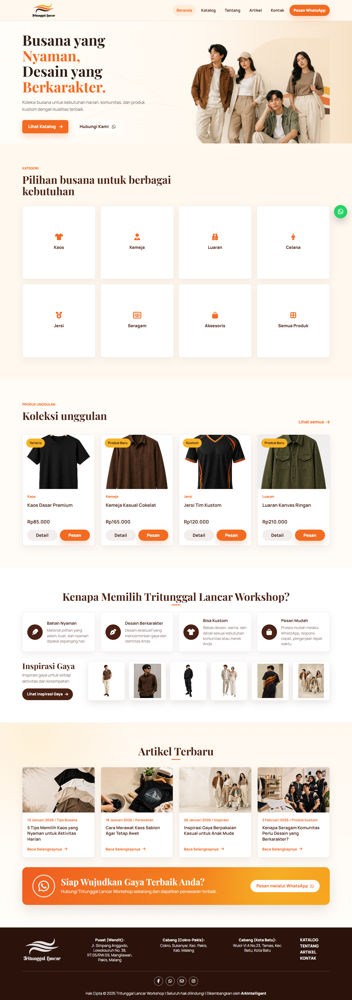
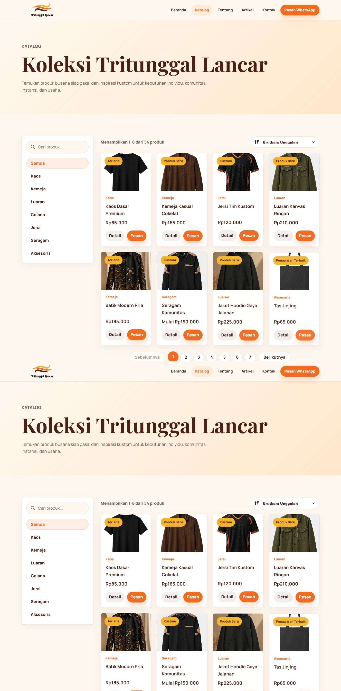

# Tritunggal Lancar - Workshop

Website katalog statis untuk Tritunggal Lancar Workshop. Dibuat dengan HTML5, CSS3, JavaScript vanilla, data JSON, dan path relatif agar mudah dipublikasikan ke GitHub Pages.

Judul beranda: `Tritunggal Lancar - Workshop`.

## Struktur

- `index.html` - landing page utama
- `catalog.html` - katalog produk dengan search, filter, dan modal detail
- `about.html` - profil brand
- `contact.html` - kontak dan form sederhana
- `blog.html` - daftar artikel
- `blog-detail.html` - detail artikel berdasarkan parameter `id`
- `assets/css/style.css` - styling website
- `assets/css/style.min.css` - CSS kecil hasil optimasi
- `assets/js/main.js` - interaksi website
- `assets/screenshots/` - tangkapan layar untuk dokumentasi README
- `data/products.json` - data produk
- `data/posts.json` - data artikel
- `tools/` - script optimasi CSS dan gambar WebP

## Fitur Utama

- Hero beranda dengan gambar utama WebP dan identitas visual Tritunggal Lancar Workshop.
- Section kategori berisi Kaos, Kemeja, Luaran, Celana, Jersi, Seragam, Aksesoris, dan Semua Produk.
- Section Keunggulan, Inspirasi Gaya, Artikel Terbaru, dan CTA WhatsApp.
- Katalog produk dengan filter kategori, pencarian, modal detail, WhatsApp order, dan paginasi 8 produk per halaman.
- Halaman Kontak berisi alamat, link WhatsApp, email, Instagram, Facebook, serta peta lokasi.
- Footer responsif dengan logo, alamat cabang, menu halaman, tombol sosial, dan link ArkIntelligent.
- SEO dasar sudah disiapkan: meta description, Open Graph, Twitter Card, JSON-LD, alt text gambar, favicon, robots, dan OG image.

## Tangkapan Layar

Tangkapan layar terbaru berada di folder `assets/screenshots/`.

- [Beranda](assets/screenshots/home.png)
- [Katalog](assets/screenshots/catalog.png)





## Isi Katalog

Katalog berisi 54 produk dengan 7 kategori utama:

- Kaos: 4 produk
- Kemeja: 4 produk
- Luaran: 7 produk
- Celana: 7 produk
- Jersi: 9 produk
- Seragam: 9 produk
- Aksesoris: 14 produk

Produk baru yang sudah disiapkan antara lain PDL, PDH, celana cargo, celana tactical, berbagai jersi olahraga, korsa, wearpack, jas lab, rompi safety, tas tambahan, bucket hat, dan buff. Semua slot gambar produk berada di `assets/img/products/` dengan pola nama `nama-produk-1.webp`, `nama-produk-2.webp`, dan `nama-produk-3.webp`.

## Optimasi Aset

Website sudah memakai WebP untuk gambar konten, `assets/img/og-image.jpg` untuk gambar share, dan `style.min.css` untuk CSS yang lebih kecil. Setelah mengganti gambar atau CSS, jalankan ulang optimasi:

```bash
npm run optimize
```

Perintah tersedia:

```bash
npm run tinycss
npm run webp
```

Jika PowerShell menolak `npm` karena execution policy Windows, gunakan `npm.cmd run optimize`.

Logo dan favicon tetap memakai PNG/ICO agar detail brand tetap aman.

Catatan untuk share link: setelah URL GitHub Pages atau domain final aktif, meta `og:url`, canonical, dan `og:image` bisa diganti ke URL absolut agar preview WhatsApp/Facebook lebih stabil.

## Preview Lokal

Website bisa dijalankan dengan server lokal apa pun, termasuk Laragon. Karena semua path dibuat relatif, file yang sama dapat dipakai untuk preview lokal dan GitHub Pages.

Jika dibuka langsung tanpa server lokal, JavaScript tetap memakai fallback data yang sudah disiapkan. Namun untuk pengujian normal, gunakan server lokal agar proses `fetch` data JSON berjalan seperti di hosting.

## Publish ke GitHub Pages

1. Upload semua file dan folder utama ke repository GitHub.
2. Buka menu repository `Settings`.
3. Masuk ke `Pages`.
4. Pilih source dari branch utama, misalnya `main`.
5. Pilih folder `/root`.
6. Simpan dan tunggu URL GitHub Pages aktif.

File yang tidak perlu diupload: folder cache lokal, `node_modules`, dan file sementara dari editor.

## Pengaturan WhatsApp

Nomor WhatsApp bisa diganti di `assets/js/main.js`:

```js
const whatsappNumber = "6281234567890";
```

Ganti dengan nomor aktif tanpa tanda plus, spasi, atau strip.
